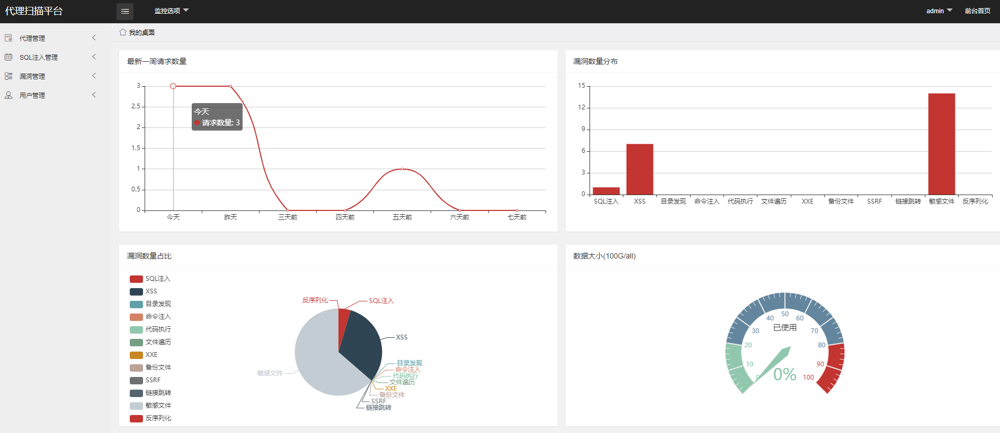
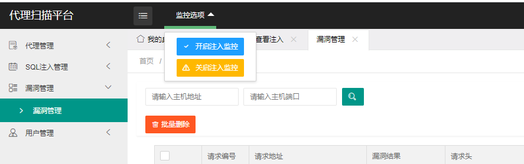
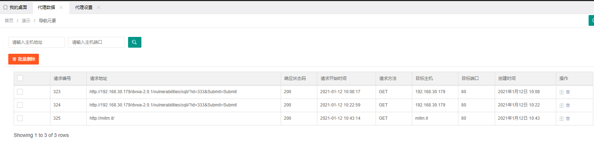
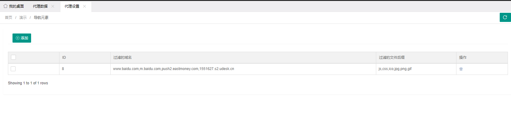
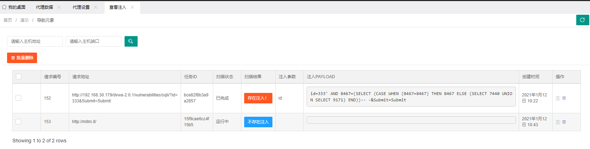
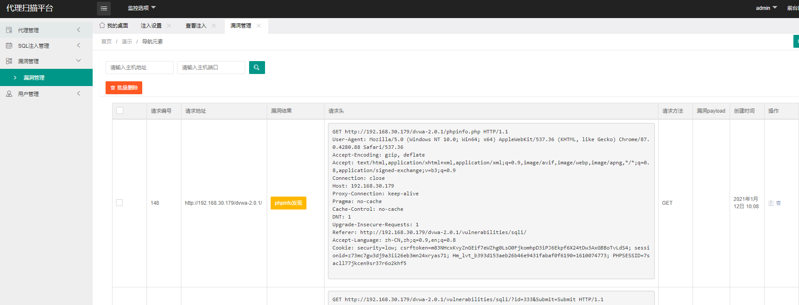

<p align="center">
    
  <h3 align="center">代理扫描平台</h3>


  <p align="center">
    又叒一个代理扫描
    <br />
  </p>

## 目录

* [关于项目](#关于项目)
* [安装](#安装)
* [使用](#使用)
* [描述](#描述)
* [License](#license)

## 关于项目

1.  项目是一个代理扫描器，现有的代理扫描平台有xray，w13scan等，只是我希望关于SQL注入的使用sqlmap来检测执行，所以就有了这个平台，本质上和GroudScan是差不多的，只是把w13scan也加入到其中来检测别的漏洞。
2.  同时也期望这个东西能做到代理扫描上的统一化，在实际工作中，开发测试对于新功能并不会实时进行安全申报，所以希望平台化的被动扫描可以帮助实现安全的加固。

## 安装

1. 环境使用MySQL，建议手动调整连接超时时间，代码会检测连接是否超时，但是可以调整超时来延缓长连接。不修改本质上也没事。
2. 安装，基于python3.7

```
mitmproxy
apscheduler
django-apscheduler
django==2.2.10
django-simpleui
PyMySQL
secrets
asn1crypto==0.24.0
certifi==2019.6.16
cffi==1.12.3
chardet==3.0.4
colorama==0.4.1
cowpy==1.1.0
cryptography==2.7
cssselect==1.1.0
idna==2.8
lxml==4.5.0
pycparser==2.19
pyjsparser==2.7.1
pyOpenSSL==18.0.0
PySocks==1.7.1
requests==2.24.0
requests-toolbelt==0.9.1
six==1.12.0
tld==0.9.3
urllib3==1.25.3
```

3.  代理模块使用mitmproxy，如果需要代理https，请在开启代理后访问地址`http://mitm.it/`下载证书，默认代理为`0.0.0.0:18088`。如需修改在myproxy/myproxys.py中修改。
4.  需要开启sqlmapapi

```
python sqlmapapi.py -s 
```

5.  为了避免流量数据堆积，只显示最近三天的流量，检索也是按照最近三天检索，如果需要修改`apps/proxy/views.py`中修改`timedelta(days=3)`为想要的天数。

## 使用

配置setting的数据库信息

```sh
python manage.py makemigrations
python manage.py migrate 
python manage.py createsuperuser
python manage.py runserver 0.0.0.0:8000
```

访问地址ip:8000即可，如需维持进程，可以使用supervisor。

#### 监控前台



#### 监控选项

注入的结果使用的`apscheduler`任务框架来定时检索，默认是一分钟执行一次。所以请开启，不然不会检查是否注入完成。如果需要修改时间请到`apps/sqli/views.py`中，修改`minutes=1`为需要的分钟。



#### 代理数据

关于搜索，需要输入请求的地址和端口来检测，也可以只输入一个值，但如果是ip加端口的形式，需要分开来一起搜索。



#### 代理设置

请在其中添加修改需要过滤的代理请求关键词，所有添加的参数都会按照并集来处理。



#### SQL注入监控

菜单下的注入设置同上。等待已完成查看结果即可，需要右上角刷新页面



#### 漏洞管理

此漏洞为w13scan扫描结果漏洞展示



## 描述

此项目主要是融合利用，存在的已知问题是：稳定性暂时没有经过大流量的测试，只是单纯的个人使用无误。如果存在其他问题，还请表哥issue。

## License

GPL-2.0 © 2020 Misakikata
